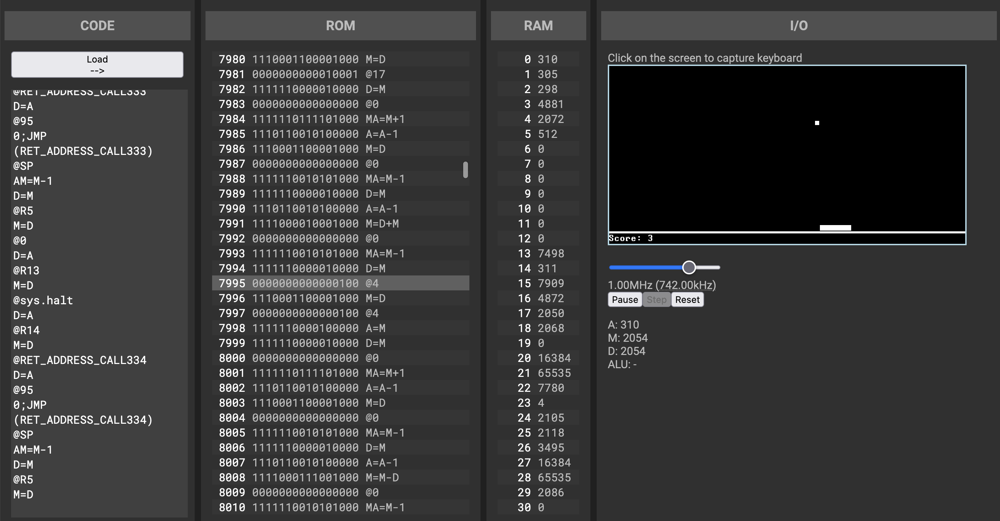

# Hack Emulator

This project emulates Hack computer from
[nand2tetris](https://www.nand2tetris.org) course. It is still under light
development (light means that I might add/fix/polish things from time to time,
but not actively).

https://hithroc.github.io/hack-emulator/



### Current features

* Built-in assembler (although it is very crude and doesn't really have error
reporting as of yet)

* ROM view, including binary machine code as well as the coresponding
instructions. Current instruction (program counter) is highlighted.

* RAM view

* Full ALU implementation, which includes undocumented instructions, unlike the
official CPU emulator.

* Adjustable clock speed (although I would not recommend to go above ~10MHz)

* Full support for keyboard input and display output.

* All in your browser on any device! No Java required!

### Kinda Maybe Sorta Planned features:

* Breakpoints

* Ability to modify values in RAM

* Running official test files

* Ahead of time compilation as well as other optimizations

* Perhaps some extensions to Hack, like

  * Memory banks

  * Colored display

  * Periferals like storage?

  * 6/N-key rollover support

* Light/dark theme support?

## Building

To build the project you need Node 12.x. Then you can just run:

```
npm install
npm run-stript build
```

This should create `app.js` file in `./dist/`. You can open `./dist/index.html`
in your browser.

## Contributing

Ha, like anyone ever will!

## Some other notes

This project was mostly written in about a week to get some practice with
TypeScript and React (given that I've not used either before), so there might
be some rough edges or non-idiomatic code/project structure. Reviews are
welcome!